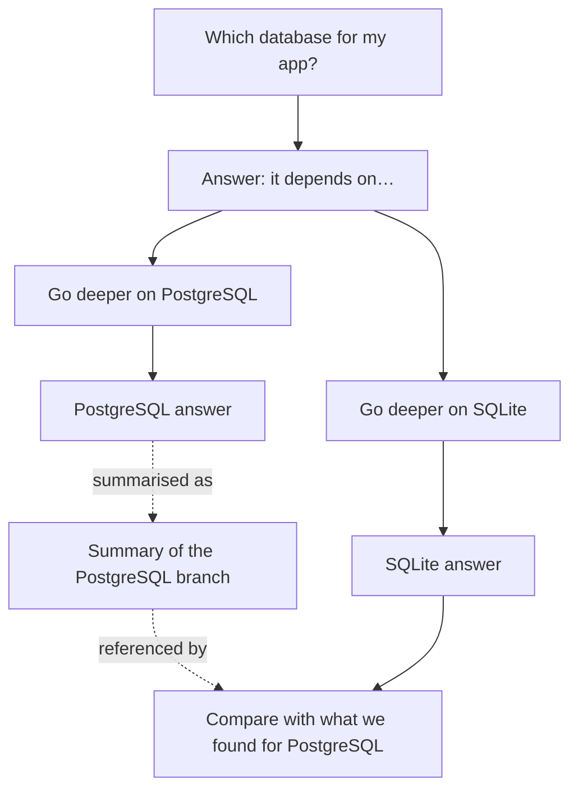

# diagram-4-llm

A local-first chat client for LLMs in which a conversation is a graph, not a
scroll. Fork at any message, see every branch on a canvas, and control
exactly what context each branch sends to the model.

> **Status: phase 0.** The core library (graph model, invariants, context
> assembly and data format) is implemented and tested. There is no user
> interface yet. See the [plan](docs/PLAN.md) for what comes next.

## The problem

Long conversations with an LLM drift across several topics. In a linear chat
two things go wrong:

- you lose track of which threads exist and what was concluded in each, and
- every new question is sent with the whole history, so unrelated threads
  leak into the answer. This hurts most on local models with small context
  windows.

## The idea



- **Branches isolate context.** The SQLite branch never sees the PostgreSQL
  discussion unless you bring it in.
- **References bring context in deliberately.** Attach a single message from
  another branch, or a summary of a whole branch.
- **Nothing is hidden.** Before sending, you can inspect the exact messages
  the model will receive.
- **Your data stays with you.** Everything is stored in your browser. Works
  with the Anthropic API and with any OpenAI-compatible endpoint, including
  local servers such as Ollama and LM Studio.

## Documentation

- [Product plan](docs/PLAN.md): problem, principles, phases, risks, open questions
- [Architecture](docs/ARCHITECTURE.md): data model, invariants, context assembly, security, testing
- [Decision records](docs/adr/)

## Development

Requires Node.js 22.13 or later and pnpm 10 (`corepack enable` provides the
version pinned in `package.json`).

```sh
pnpm install
pnpm check   # typecheck, lint, format check, tests and build
pnpm e2e     # end-to-end tests against the production build (Playwright)
pnpm --filter @diagram-4-llm/web dev   # run the web app locally
```

End-to-end tests need Chromium for the installed Playwright version
(`pnpm --filter @diagram-4-llm/web exec playwright install chromium`). To use
an existing Chromium instead, set `PLAYWRIGHT_CHROMIUM_EXECUTABLE` to its path.

| Path                             | Contents                                                                                          |
| -------------------------------- | ------------------------------------------------------------------------------------------------- |
| [`packages/core`](packages/core) | Graph model, invariants, context assembly and data format. Pure TypeScript, no I/O.               |
| [`apps/web`](apps/web)           | Browser app. Currently a shell with a strict Content Security Policy; phase 1 builds the UI here. |

## How this project is built

This project is developed with substantial help from AI coding tools, under
the direction of a human maintainer. The process is designed so that you can
judge the result on evidence rather than trust:

- design decisions are written down as ADRs before they are implemented,
- domain logic is isolated in a pure package with unit and property-based
  tests, and CI runs them on every change,
- every change goes through a pull request made of small commits that
  explain why the change is needed,
- the rules given to AI agents are public in [CLAUDE.md](CLAUDE.md).

The maintainer has authorised AI agents to merge their own pull requests once
CI passes. Not every pull request is reviewed by a person before it is
merged, so CI and the rules above are the gate.

If you find code that does not meet that bar, please open an issue.

## License

Not yet chosen.
