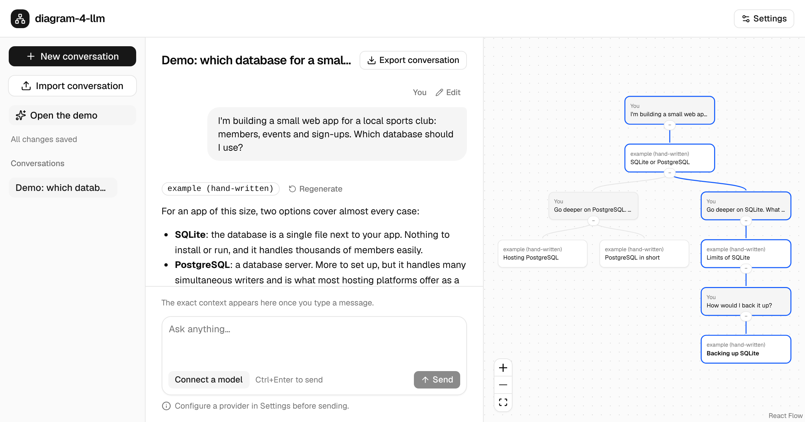
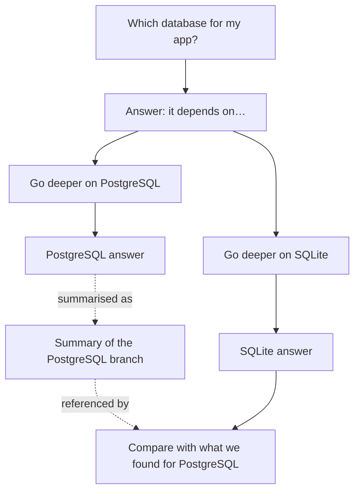

# diagram-4-llm

[](https://github.com/ProductPope/diagram-4-llm/actions/workflows/ci.yml)
[](LICENSE)

A local-first chat client for LLMs in which a conversation is a graph, not a
scroll. Fork at any message, see every branch on a canvas, and control
exactly what context each branch sends to the model.

> **Status: phase 1, in progress.** You can chat with an Anthropic model or
> any OpenAI-compatible server, edit and regenerate messages to create
> branches, switch between versions, inspect the exact context before
> sending, see the whole conversation as a tree, and keep conversations in
> the browser. The [plan](docs/PLAN.md) tracks what phase 1 still lacks.

**Try it:** https://productpope.github.io/diagram-4-llm/ (runs entirely in
your browser; bring an Anthropic API key or a local model server).



## The problem

Long conversations with an LLM drift across several topics. In a linear chat
two things go wrong:

- you lose track of which threads exist and what was concluded in each, and
- every new question is sent with the whole history, so unrelated threads
  leak into the answer. This hurts most on local models with small context
  windows.

## The idea



- **Branches isolate context.** The SQLite branch never sees the PostgreSQL
  discussion unless you bring it in.
- **References bring context in deliberately.** Attach a single message from
  another branch, or a summary of a whole branch.
- **Nothing is hidden.** Before sending, you can inspect the exact messages
  the model will receive.
- **Your data stays with you.** Everything is stored in your browser. Works
  with the Anthropic API and with any OpenAI-compatible endpoint, including
  local servers such as Ollama and LM Studio.

## Documentation

- [Product plan](docs/PLAN.md): problem, principles, phases, risks, open questions
- [Architecture](docs/ARCHITECTURE.md): data model, invariants, context assembly, security, testing
- [Decision records](docs/adr/)
- [Contributing](CONTRIBUTING.md) and the [security policy](SECURITY.md)

## Development

Requires Node.js 22.13 or later and pnpm 10 (`corepack enable` provides the
version pinned in `package.json`).

```sh
pnpm install
pnpm check   # typecheck, lint, format check, tests and build
pnpm e2e     # end-to-end tests against the production build (Playwright)
pnpm --filter @diagram-4-llm/web dev   # run the web app locally
```

The code is in four packages:

| Path                             | Contents                                                                                |
| -------------------------------- | --------------------------------------------------------------------------------------- |
| [`packages/core`](packages/core) | Graph model, invariants, context assembly and data format. Pure TypeScript, no I/O.     |
| [`apps/web`](apps/web)           | Browser app: chat, branching, context inspector, provider adapters and storage.         |
| [`packages/mcp`](packages/mcp)   | Local MCP server that lets agents read exported conversations and Claude Code sessions. |
| [`apps/desktop`](apps/desktop)   | Desktop app: the web app in a Tauri window, with the API key in the system keychain.    |

### Connecting a model

On a first visit the app opens on a short welcome page, from which you can
open a demo conversation without any setup, or start the setup assistant:
choose a provider, test the connection and pick models from the ones it
offers. The same settings
can be changed later in **Settings**. The providers are:

- **OpenAI-compatible** for a local server such as Ollama or LM Studio, or a
  hosted service with that API. The server must allow the app's origin
  through CORS. For Ollama, start it with `OLLAMA_ORIGINS` set to the
  app's address, for example
  `OLLAMA_ORIGINS=http://localhost:5173 ollama serve` for the development
  server, or `OLLAMA_ORIGINS=https://productpope.github.io` for the hosted
  app. Your browser may ask for permission before a website can reach a
  server on your own computer. For other servers, see their CORS settings.
- **Anthropic** with your own API key.

Optionally, name a **model for node titles**. Each finished answer then gets
a short title on the map, at the cost of one small extra request per answer,
so a cheap or local model is a good choice. Without it, map nodes show the
start of each message.

The API key is stored in your browser's local storage and sent only to the
provider you configure. Any script running on the page could read it; the
app loads no third-party scripts and ships a strict Content Security Policy
to keep it that way.

### Desktop app

The desktop app keeps the API key in the operating system's keychain
(Keychain on macOS, Credential Manager on Windows, the Secret Service on
Linux) instead of the page's storage, and reaches local model servers such
as Ollama and LM Studio without any CORS setup. It needs Rust and the
[Tauri prerequisites](https://v2.tauri.app/start/prerequisites/) for your
system. Builds are not signed.

```sh
pnpm --filter @diagram-4-llm/desktop tauri dev     # run it against the web dev server
pnpm --filter @diagram-4-llm/desktop tauri build   # build an installer for this system
```

Its end-to-end test runs on Linux against a debug build, with
`tauri-driver` (`cargo install tauri-driver --locked`), WebKitWebDriver,
gnome-keyring, `secret-tool` and Xvfb installed:

```sh
pnpm --filter @diagram-4-llm/desktop tauri build --debug --no-bundle
DESKTOP_APP=$PWD/apps/desktop/src-tauri/target/debug/diagram-4-llm \
  pnpm --filter @diagram-4-llm/desktop e2e
```

### Tests

End-to-end tests need Chromium for the installed Playwright version
(`pnpm --filter @diagram-4-llm/web exec playwright install chromium`). To use
an existing Chromium instead, set `PLAYWRIGHT_CHROMIUM_EXECUTABLE` to its path.

## How this project is built

This project is developed with substantial help from AI coding tools, under
the direction of a human maintainer. The process is designed so that you can
judge the result on evidence rather than trust:

- design decisions are written down as ADRs before they are implemented,
- domain logic is isolated in a pure package with unit and property-based
  tests, and CI runs them on every change,
- every change goes through a pull request made of small commits that
  explain why the change is needed,
- the rules given to AI agents are public in [CLAUDE.md](CLAUDE.md).

The maintainer has authorised AI agents to merge their own pull requests once
CI passes. Not every pull request is reviewed by a person before it is
merged, so CI and the rules above are the gate.

If you find code that does not meet that bar, please open an issue.

## License

[MIT](LICENSE)
